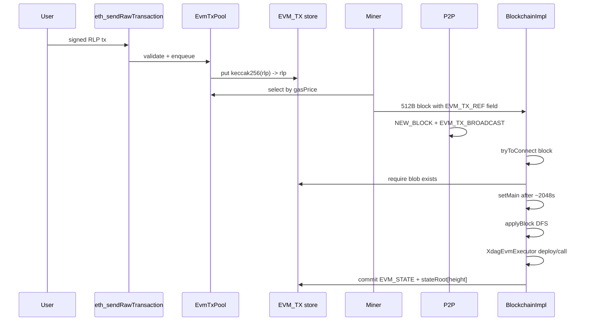

# XDAG EVM — Sub-project B2 R1 Protocol Spec

- **Date:** 2026-07-01
- **Branch:** `dev-evm`
- **Status:** Draft — R1 payload-by-reference **confirmed**
- **Depends on:** Sub-project A (Besu executor), B1 (`RocksDbWorldUpdater`, `EVM_STATE`). See `2026-06-06-xdag-evm-subproject-b-design.md`.

## 1. Problem statement

XDAG blocks are fixed **512 bytes = 16 × 32-byte fields** (`XdagBlock.XDAG_BLOCK_FIELDS = 16`). A legacy Ethereum type-0 transaction with multi-KB contract initcode (e.g. USDT deploy) cannot fit inline. **R2 (inline calldata) is rejected.**

**R1 (payload-by-reference)** stores the full EIP-155 RLP blob in a side store; the 512-byte block carries only a **32-byte commitment** (tx hash). Execution order reuses the existing deterministic `BlockchainImpl.applyBlock()` depth-first traversal — no separate Conflux GHAST module.

---

## 2. End-to-end flow



---

## 3. Block format extension

### 3.1 New field type

Reuse reserved nibble **`0x0F`** currently named `XDAG_FIELD_RESERVE6` in [`XdagField.FieldType`](src/main/java/io/xdag/core/XdagField.java):

| Name | Nibble | Semantics |
|------|--------|-----------|
| `XDAG_FIELD_EVM_TX_REF` | `0x0F` | 32-byte EVM transaction hash (keccak256 of canonical signed RLP) |

**Field layout (32 bytes):**

```
bytes[0..31]  = txHash (big-endian, same as Ethereum tx hash)
```

No amount prefix (unlike `INPUT`/`OUTPUT` address fields). The field is a pure hash reference.

**Hard-fork activation:** configurable `evm.activationHeight` per network (devnet first). Blocks before activation MUST NOT contain `0x0F` fields; nodes reject post-activation blocks missing required blobs.

### 3.2 Carrier block types

An EVM transaction is included in the DAG via one of:

| Pattern | Description | When |
|---------|-------------|------|
| **Account tx block** | Standard account tx (`INPUT`/`OUTPUT`/`TRANSACTION_NONCE`) + one `EVM_TX_REF` field | User pays native XDAG gas fee; EVM tx referenced |
| **Witness / link block** | Miner or relay packs `EVM_TX_REF` in a link block later referenced by main block | Pool-driven inclusion |

Constraints:
- Max **one `EVM_TX_REF` per block** in v1 (simplifies apply/unapply). Multiple refs → v2.
- Block MUST pass existing signature / nonce / fee rules for its carrier type.
- **`tryToConnect` validation:** for each `EVM_TX_REF`, `EVM_TX` store MUST contain `txHash → rlp`. Otherwise `ImportResult.INVALID_BLOCK`.

### 3.3 Field budget example

Account tx block (typical):
- field 0: HEAD
- fields 1–3: INPUT, OUTPUT, TRANSACTION_NONCE (+ signatures)
- field 4: `EVM_TX_REF` (32 B hash)
- remaining slots: DAG links / remark

Total payload stays within 512 B.

---

## 4. EVM_TX store

### 4.1 Database

Add to [`DatabaseName`](src/main/java/io/xdag/db/rocksdb/DatabaseName.java):

```java
/** Signed EIP-155 RLP transaction blobs keyed by tx hash. */
EVM_TX,
/** Per-main-block EVM state roots + execution metadata. */
EVM_META,
```

(`EVM_STATE` already exists for world state — see [`EvmStateSchema`](src/main/java/io/xdag/evm/state/EvmStateSchema.java).)

### 4.2 Key layout — EVM_TX

| Key | Value |
|-----|-------|
| `0x00 \| txHash(32)` | `rlpSignedTx` (variable length) |

Optional index keys (P1):

| Key | Value |
|-----|-------|
| `0x01 \| sender(20) \| nonce(8 BE)` | `txHash(32)` |
| `0x02 \| mainHeight(8 BE) \| txIndex(4 BE)` | `txHash(32)` |

### 4.3 Key layout — EVM_META

| Key | Value |
|-----|-------|
| `0x00 \| mainHeight(8 BE)` | `stateRoot(32) \| blockHash(32) \| txCount(4 BE)` |
| `0x01 \| txHash(32)` | `receiptRLP` (status, gasUsed, logs, contractAddress) |

### 4.4 Mempool (`EvmTxPool`)

In-memory + optional disk spill:

1. Accept raw RLP via RPC or P2P.
2. Parse type-0 legacy tx; recover sender via EIP-155 (`v = chainId*2 + 35/36`).
3. Validate: `chainId`, signature, intrinsic gas, nonce == EVM account nonce (from `RocksDbWorldUpdater`).
4. Insert keyed by `(sender, nonce)` and priority queue by **effective gas price** (legacy: `gasPrice`).
5. On accept: `EVM_TX.put(txHash, rlp)` (idempotent).
6. Expire after `evm.txPoolTtlSeconds` (default 3600).

Miners call `selectTransactions(maxCount, minGasPrice)` when building blocks — analogous to [`OrphanBlockStoreImpl`](src/main/java/io/xdag/db/rocksdb/OrphanBlockStoreImpl.java) fee ordering.

---

## 5. Transaction format

### 5.1 Supported tx types (v1)

| Type | Support |
|------|---------|
| Legacy type-0 (EIP-155) | **Yes** — `eth_sendRawTransaction` primary path |
| EIP-2930 / 1559 / 4844 | **No** (v2+) — no `baseFeePerGas` in XDAG blocks today |

RLP fields: `nonce, gasPrice, gasLimit, to, value, data, chainId, 0, 0, v, r, s`.

### 5.2 Execution mapping

| `to` field | Action |
|------------|--------|
| empty (`CREATE`) | `XdagEvmExecutor.deploy(sender, initCode=data, value, gasLimit)` |
| 20-byte address | `XdagEvmExecutor.call(sender, to, callData=data, value, gasLimit)` |

Block context passed to Besu `MessageFrame` (B2 implementation):
- `blockNumber` = main block height
- `timestamp` = main block XDAG timestamp (converted to seconds)
- `coinbase` = main block miner EVM address
- `gasLimit` = config `evm.blockGasLimit` (default 30_000_000)

### 5.3 Tx hash

`txHash = keccak256(rlpSignedTx)` — identical to Ethereum. Used as `EVM_TX_REF` field content and `eth_getTransactionByHash` key.

---

## 6. P2P protocol

### 6.1 New message codes

Allocate from unused range `[0x1B, 0x1F]` in [`MessageCode`](src/main/java/io/xdag/net/message/MessageCode.java):

| Code | Name | Direction | Payload |
|------|------|-----------|---------|
| `0x1B` | `EVM_TX_BROADCAST` | push | `txHash(32) \| rlpLen(4 BE) \| rlpSignedTx` |
| `0x1C` | `EVM_TX_REQUEST` | request | `txHash(32)` repeated |
| `0x1D` | `EVM_TX_REPLY` | response | same as BROADCAST body |
| `0x1E` | `EVM_RECEIPT_REQUEST` | request | `txHash(32)` |
| `0x1F` | `EVM_RECEIPT_REPLY` | response | `receiptRLP` |

Max message size: `evm.maxP2pTxBytes` (default 128 KiB) — sufficient for contract deploy blobs.

### 6.2 Gossip rules

1. On `eth_sendRawTransaction` or local wallet submit: store + `EVM_TX_BROADCAST` to all peers.
2. On `NEW_BLOCK` / `SYNC_BLOCK`: parse `EVM_TX_REF` fields; for missing blobs, send `EVM_TX_REQUEST` to peer that announced the block.
3. Do not relay duplicate `(txHash)` within `evm.txGossipDedupSeconds`.
4. Block import MUST NOT succeed until all referenced blobs are present (or marked unavailable → reject block).

### 6.3 Sync

During chain sync (`SyncManager`), after block batch:
- Collect all `EVM_TX_REF` hashes from imported blocks.
- Batch `EVM_TX_REQUEST` to sync peer.
- Resume block execution only when blobs complete.

---

## 7. Consensus integration

### 7.1 Execution timing

| Event | Native XDAG | EVM (R1) |
|-------|-------------|----------|
| `tryToConnect` | Validate structure, store block | Validate blobs exist; **no EVM execution** |
| `setMain` | `applyBlock` → AddressStore | `applyBlock` → `executeEvmRefs` → commit `RocksDbWorldUpdater` |
| `unWindMain` | `unApplyBlock` | Revert EVM to checkpoint at fork ancestor |

**Rationale:** align EVM finality with native main-block confirmation (~2048 s after block timestamp per `checkNewMain`).

### 7.2 Ordering

Deterministic order = **DFS order of `applyBlock()`** over link blocks, and **field order within each block** for multiple refs (v2 only; v1 has at most one ref).

Within one main block epoch:
1. Recursively apply referenced link blocks (existing logic).
2. When visiting a block with `EVM_TX_REF`, load RLP, execute, append to receipt list.
3. After all refs processed: compute state root, write `EVM_META`.

All nodes with the same DAG view produce the same execution trace.

### 7.3 `applyBlock` hook (pseudocode)

```java
// After native INPUT/OUTPUT processing succeeds:
for (Address link : block.getLinks()) {
    if (link.getType() == XDAG_FIELD_EVM_TX_REF) {
        Hash txHash = Hash.wrap(link.getHash32());
        byte[] rlp = evmTxStore.get(txHash);
        LegacyTransaction tx = decode(rlp);
        Address sender = recoverSender(tx);
        XdagExecutionResult result = tx.isCreate()
            ? evmExecutor.deploy(journalUpdater, sender, tx.getData(), tx.getValue(), tx.getGasLimit())
            : evmExecutor.call(journalUpdater, sender, tx.getTo(), tx.getData(), tx.getValue(), tx.getGasLimit());
        receipts.add(buildReceipt(txHash, result));
    }
}
// On setMain path only:
if (flag) {  // main block root apply
    journalUpdater.commit();
    stateRoot = computeStateRoot();
    evmMetaStore.put(mainHeight, stateRoot, receipts);
}
```

Use a **nested `WorldUpdater`** (child of root) during traversal; commit once per main block at the end of `setMain`.

### 7.4 Reorg / rollback

**Strategy: checkpoint + replay** (recommended in Decision Record).

1. Before each `setMain`, persist `EVM_META[mainHeight] = { stateRoot, blockHash, txCount }`.
2. On `unWindMain` to ancestor height `H`:
   - Load `stateRoot` at `H` (or empty genesis root).
   - **Option A (v1 devnet):** truncate `EVM_STATE` keys not in checkpoint snapshot; replay main blocks `(H+1 .. newTip]` — slow but simple.
   - **Option B (production):** periodic full state snapshots every `N` main blocks + journal diff — implement in P1.
3. Delete `EVM_META` entries with height > fork point.
4. Re-execute queued EVM refs on the new canonical chain.

Native [`unApplyBlock`](src/main/java/io/xdag/core/BlockchainImpl.java) does not need to inverse EVM ops if EVM commit only happens at `setMain` boundaries.

### 7.5 Validation rules (consensus)

| Rule | Check |
|------|-------|
| Blob presence | `EVM_TX[txHash]` exists before block import |
| Signature | EIP-155 recover == tx sender |
| Nonce | `tx.nonce == evmAccountNonce(sender)` at execution time |
| Balance | `evmBalance(sender) >= tx.value + tx.gasLimit * tx.gasPrice` OR native fee pre-paid (see Decision Record) |
| Gas | `tx.gasLimit <= evm.blockGasLimit` |
| Intrinsic gas | `tx.data.length` passes EIP-2028/EIP-3860 rules (Shanghai) |
| Duplicate | Same `txHash` not executed twice on canonical chain |
| Revert | Failed EVM tx: receipt `status=0`, state journal reverted for that tx only |

Invalid EVM txs consume gas up to limit; block remains valid (Conflux model).

---

## 8. Kernel wiring

Add to [`Kernel.testStart()`](src/main/java/io/xdag/Kernel.java):

```java
KVSource<byte[], byte[]> evmStateStore = dbFactory.getDB(DatabaseName.EVM_STATE);
KVSource<byte[], byte[]> evmTxStore = dbFactory.getDB(DatabaseName.EVM_TX);
KVSource<byte[], byte[]> evmMetaStore = dbFactory.getDB(DatabaseName.EVM_META);
RocksDbWorldUpdater evmWorld = new RocksDbWorldUpdater(evmStateStore);
XdagEvmExecutor evmExecutor = new XdagEvmExecutor(EvmConfig.forNetwork(config));
EvmTxPool evmTxPool = new EvmTxPool(evmTxStore, evmWorld, config);
blockchain.setEvmServices(evmExecutor, evmWorld, evmTxPool, evmTxStore, evmMetaStore);
```

Register P2P handlers for `0x1B–0x1F` in channel pipeline alongside existing block handlers.

---

## 9. Configuration (HOCON)

Add to `xdag-devnet.conf` / testnet / mainnet:

```hocon
evm {
  enabled = true
  activationHeight = 0          # devnet; set per network
  chainId = 51966               # 0xCAFE provisional devnet
  blockGasLimit = 30000000
  txPoolTtlSeconds = 3600
  maxP2pTxBytes = 131072
  minGasPrice = 1000000000      # 1 gwei equivalent in wei
}
```

---

## 10. Implementation checklist (B2 code tasks)

| # | Task | Package |
|---|------|---------|
| 1 | Rename `RESERVE6` → `EVM_TX_REF`; parse in `Block` / `Address` | `io.xdag.core` |
| 2 | Add `EVM_TX`, `EVM_META` to `DatabaseName` + factory | `io.xdag.db` |
| 3 | `EvmTxPool`, RLP decode, EIP-155 recover | `io.xdag.evm.tx` |
| 4 | P2P messages + handlers | `io.xdag.net.message` |
| 5 | `executeEvmRefs` in `BlockchainImpl.applyBlock` | `io.xdag.core` |
| 6 | Checkpoint / reorg in `unWindMain` | `io.xdag.core` |
| 7 | `EvmMetaStore` receipts + state roots | `io.xdag.evm.state` |
| 8 | Devnet hard-fork height + config | `io.xdag.config` |
| 9 | Integration test: deploy + call on mock chain | `src/test` |

---

## 11. Out of scope (→ Sub-project C)

- `eth_*` JSON-RPC surface
- MetaMask / Hardhat E2E
- Bloom filters / log indexes (P1)
- Native↔EVM balance bridge
- EIP-1559 / blob txs

See `2026-06-06-xdag-evm-decision-record.md` for governance decisions and `2026-06-06-xdag-evm-subproject-a-design.md` §2 for C scope.
